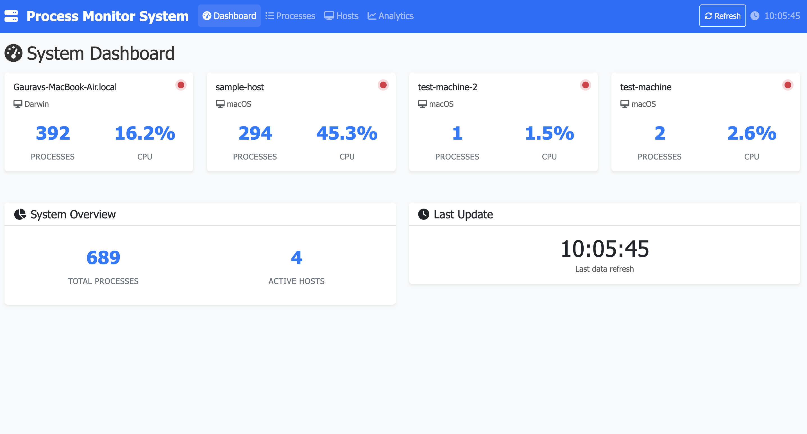
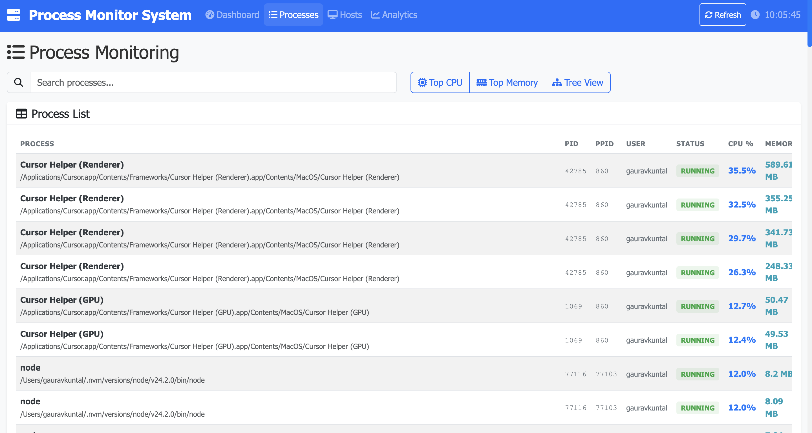
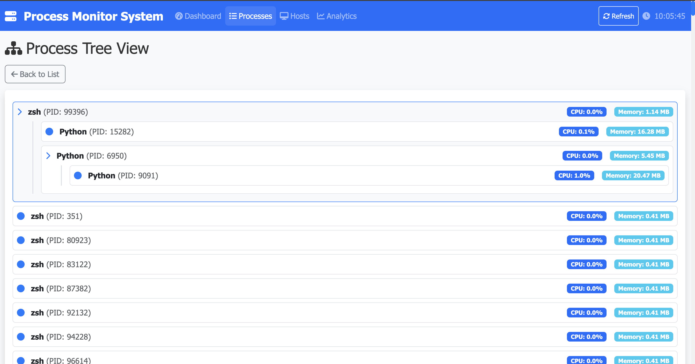
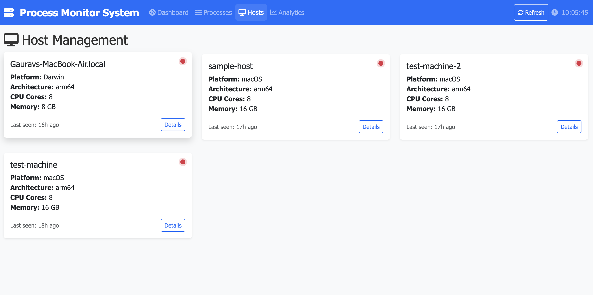
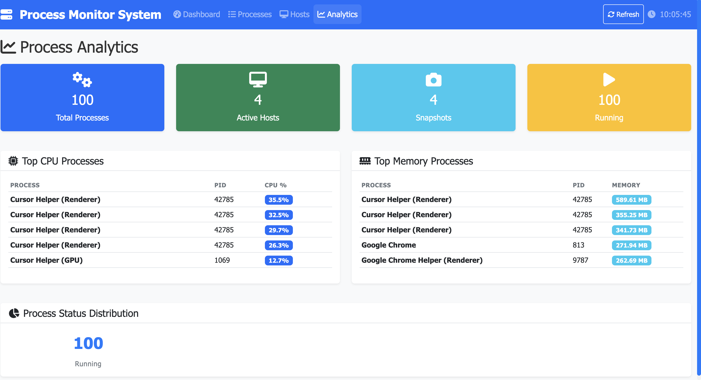

# Process Monitoring System

A comprehensive, cross-platform system for monitoring running processes with a Django backend and modern web frontend.

**👨‍💻 Owner & Developer:** [@kuntalgaurav2001](https://github.com/kuntalgaurav2001)

> **⚠️ IMPORTANT:** This code is owned by **@kuntalgaurav2001**. Any modifications, forks, or derivative works must maintain proper attribution and respect the original ownership. Unauthorized commercial use or redistribution without permission is prohibited.

## 🚀 Features

- **Cross-Platform Agent**: Monitor processes on Windows, macOS, and Linux
- **Real-time Data Collection**: Collect CPU, memory, and process hierarchy data
- **Interactive Web Dashboard**: Modern, responsive interface with process tree visualization
- **RESTful API**: Clean API for data submission and retrieval
- **Process Filtering**: Privacy-focused process exclusion capabilities
- **Professional UI**: Bootstrap-based responsive design with interactive components

## 📋 Requirements

### Agent Requirements
- ✅ Written in Python (compilable to EXE using PyInstaller)
- ✅ Collects process name/PID, CPU/Memory usage, parent-child relationships
- ✅ Sends data to Django backend via REST API
- ✅ Configurable backend endpoint
- ✅ Cross-platform support (Windows, macOS, Linux)

### Backend Requirements
- ✅ Django REST Framework for API endpoints
- ✅ SQLite database with appropriate schema
- ✅ API key authentication for agents
- ✅ Hostname identification and management
- ✅ Endpoints for data submission and retrieval

### Frontend Requirements
- ✅ Interactive tree-like display of processes
- ✅ Expandable/collapsible subprocesses
- ✅ Latest data with timestamp and refresh capability
- ✅ Hostname information display
- ✅ Clean, responsive UI with Bootstrap

## 📸 Screenshots & Demo

### 🎥 Demo Video
Watch the system in action: **[TaskVideo.mp4](TaskVideo.mp4)** - Complete demonstration of all features

### 📱 Dashboard Overview

*Main dashboard showing system overview, host cards, and real-time metrics*

### 🔍 Process Monitoring

*Process list view with search, filtering, and detailed process information*

### 🌳 Process Tree View

*Hierarchical process tree showing parent-child relationships*

### 🖥️ Host Management

*Host overview with platform details, resource usage, and status indicators*

### 📊 Process Analytics

*Analytics dashboard with top CPU/memory processes and status distribution*

## 🏗️ Architecture

```
┌─────────────────┐    HTTP/REST    ┌─────────────────┐    WebSocket/HTTP    ┌─────────────────┐
│                 │ ◄──────────────► │                 │ ◄──────────────────► │                 │
│   Agent(s)      │                 │   Django        │                      │   Web Frontend  │
│   (Executable)  │                 │   Backend       │                      │   (Browser)     │
│                 │                 │                 │                      │                 │
└─────────────────┘                 └─────────────────┘                      └─────────────────┘
         │                                   │                                        │
         │                                   ▼                                        ▼
┌─────────────────┐                 ┌─────────────────┐                      ┌─────────────────┐
│                 │                 │                 │                      │                 │
│   System        │                 │   SQLite        │                      │   Process Tree  │
│   Processes     │                 │   Database      │                      │   Visualization │
│                 │                 │                 │                      │                 │
└─────────────────┘                 └─────────────────┘                      └─────────────────┘
```

## 📁 Project Structure

```
process-monitor-system/
├── agent/                          # Process monitoring agent
│   ├── src/                       # Source code
│   ├── build_scripts/             # Platform-specific build scripts
│   ├── requirements.txt            # Python dependencies
│   └── env.agent                  # Agent configuration
├── backend/                        # Django backend server
│   ├── process_monitor/           # Django project settings
│   ├── process_api/               # Main Django app
│   ├── requirements.txt            # Python dependencies
│   └── env.config                 # Backend configuration
├── frontend/                       # Web frontend
│   ├── static/                    # CSS, JavaScript, images
│   └── templates/                 # HTML templates
├── docs/                          # Documentation
├── BUILD_INSTRUCTIONS.md          # Build and deployment guide
├── ARCHITECTURE.md                # System architecture overview
├── API_SPECIFICATIONS.md          # API documentation
└── README.md                      # This file
```

## 🛠️ Quick Start

### 1. Backend Setup
```bash
cd backend
python -m venv venv
source venv/bin/activate  # On Windows: venv\Scripts\activate
pip install -r requirements.txt
python manage.py migrate
python manage.py runserver
```

### 2. Agent Setup
```bash
cd agent
python -m venv venv
source venv/bin/activate  # On Windows: venv\Scripts\activate
pip install -r requirements.txt
python main.py
```

### 3. Frontend Access
Open your browser and navigate to: `http://localhost:8000`

## 🔧 Configuration

### Backend Configuration (`backend/env.config`)
```bash
SECRET_KEY=your-secret-key
DEBUG=True
API_KEY=your-secure-api-key
ALLOWED_HOSTS=localhost,127.0.0.1
```

### Agent Configuration (`agent/env.agent`)
```bash
BACKEND_URL=http://localhost:8000/api/v1
API_KEY=your-secure-api-key
COLLECTION_INTERVAL=60
ENABLE_PROCESS_FILTERING=true
FILTERED_PROCESS_NAMES=cursor,chrome,firefox,safari
```

## 📊 Features Overview

### Dashboard
- **System Overview**: Host count, process count, latest snapshot
- **Real-time Metrics**: CPU and memory usage across hosts
- **Quick Actions**: Navigate to different sections

### Process Management
- **Process List**: Searchable, filterable process table
- **Process Tree**: Interactive hierarchical visualization
- **Process Details**: CPU, memory, status, and metadata

### Host Management
- **Host Overview**: Platform, architecture, resource information
- **Host Status**: Active/inactive status and last seen
- **Resource Metrics**: CPU count, memory, and performance data

### Analytics
- **Process Analytics**: Top CPU/memory processes
- **Status Distribution**: Process status breakdown
- **Performance Metrics**: System resource utilization

## 🚀 Deployment

### Development
- Use Django development server
- SQLite database
- Local agent execution

### Production
- Gunicorn/uWSGI server
- PostgreSQL/MySQL database
- Compiled agent executables
- HTTPS with proper security

## 📚 Documentation

- **[Build Instructions](BUILD_INSTRUCTIONS.md)**: Complete setup and deployment guide
- **[Architecture](ARCHITECTURE.md)**: System design and component details
- **[API Specifications](API_SPECIFICATIONS.md)**: REST API documentation
- **[Assumptions & Limitations](ASSUMPTIONS_AND_LIMITATIONS.md)**: System constraints and workarounds

## 🔒 Security Features

- **API Key Authentication**: Secure agent-backend communication
- **Process Filtering**: Privacy-focused process exclusion
- **CORS Protection**: Configurable cross-origin access
- **Input Validation**: Comprehensive data sanitization

## 🎯 Use Cases

- **System Administration**: Monitor server and workstation processes
- **Development**: Track application resource usage
- **Security**: Audit running processes and system resources
- **Performance**: Analyze system performance and bottlenecks
- **Compliance**: Maintain process monitoring records

## 🤝 Contributing

### Guidelines for Contributors
1. **Fork the repository** (maintain attribution to @kuntalgaurav2001)
2. **Create a feature branch** from your fork
3. **Make your changes** with proper documentation
4. **Test thoroughly** before submitting
5. **Submit a pull request** with clear description
6. **Maintain ownership attribution** in all derivative works

### Code of Conduct
- Respect the original ownership and attribution
- Provide constructive feedback
- Follow the established coding standards
- Maintain the professional quality of the project

## 📄 License & Ownership

### Copyright Notice
```
Copyright (c) 2025 @kuntalgaurav2001
All rights reserved.

This software is the intellectual property of @kuntalgaurav2001.
Unauthorized copying, modification, distribution, or use of this software,
via any medium, is strictly prohibited without the express written
permission of the copyright holder.
```

### Usage Terms
- **Educational Use**: ✅ Allowed with proper attribution
- **Personal Projects**: ✅ Allowed with proper attribution
- **Commercial Use**: ❌ Requires explicit permission from @kuntalgaurav2001
- **Redistribution**: ❌ Prohibited without written consent
- **Modification**: ✅ Allowed for personal use, must maintain attribution

## 🆘 Support

### Getting Help
- **GitHub Issues**: Open an issue for bugs or feature requests
- **Documentation**: Check the comprehensive docs in the `docs/` folder
- **Troubleshooting**: Review the troubleshooting section in build instructions
- **Contact**: Reach out to @kuntalgaurav2001 for support

### Common Issues
- Check logs in the `logs/` directory
- Verify configuration files are properly set
- Ensure all dependencies are installed
- Check network connectivity for agent-backend communication

## 🌟 Acknowledgments

- **Original Developer**: @kuntalgaurav2001
- **Technologies**: Django, Python, Bootstrap, JavaScript
- **Community**: Open source contributors and supporters

## 📞 Contact Information

- **GitHub**: [@kuntalgaurav2001](https://github.com/kuntalgaurav2001)
- **Project**: [Process Monitoring System](https://github.com/kuntalgaurav2001/process-monitor-system)
- **Issues**: [GitHub Issues](https://github.com/kuntalgaurav2001/PROCESS-MONITOR-AGENT/issues)

---

**Built with ❤️ by @kuntalgaurav2001 using Python, Django, and modern web technologies**

> **🔒 Remember**: This code belongs to @kuntalgaurav2001. Respect intellectual property rights and maintain proper attribution in all uses.
